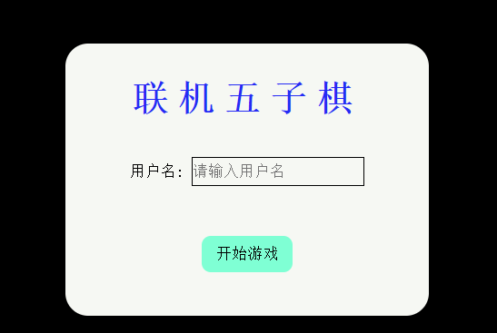
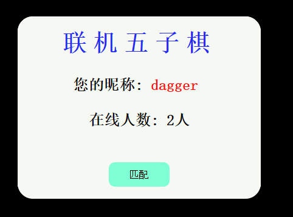
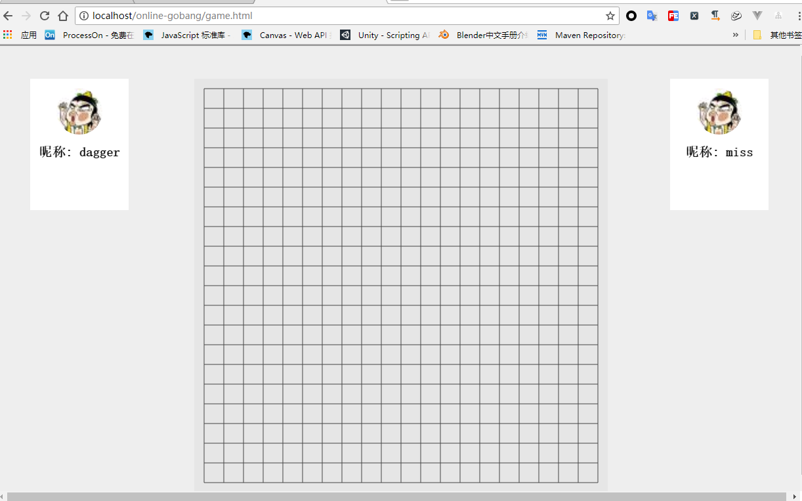

# 五子棋在线版  
> [五子棋单机版请click here...](https://github.com/dagger9527/gobang-ui)  

底层通过socket传输数据, 目前google浏览器不支持直接运行, 火狐浏览器可以, 如果没有火狐浏览器, 请将此项目放到apache、tomcat等web容器中方能正常运行. 在运行项目前请先安装node环境，并安装npm包管理器。在根目录执行npm i以安装所需要的模块
  server.js是服务器文件 
  game.html是客户端的入口文件  
 
    server.js socket服务器
    gobang-ui.html 是玩家下棋页面
    index.html 是用户登陆界面
    home.html 是用户大厅界面, 用来匹配等待的, 如果在线人数少于2人, 则匹配失败, 并会返回错误信息

## 首页 [index.html]
 
## 大厅页面 [home.html]
 
## 游戏界面 [game.html]
 
